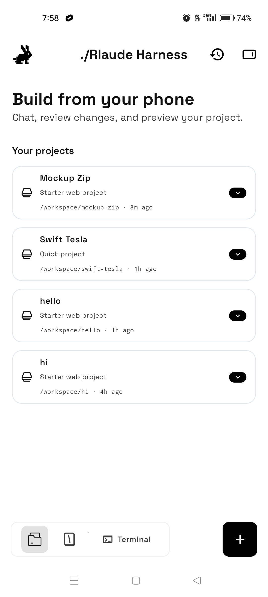
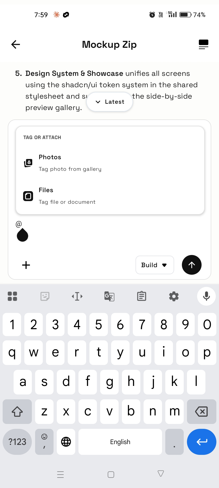
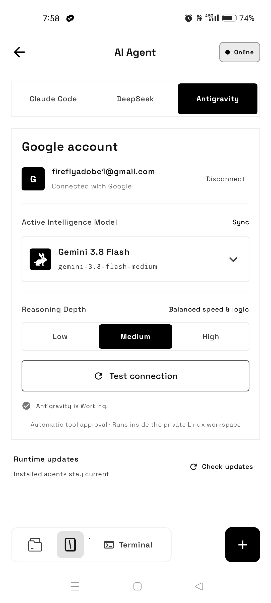
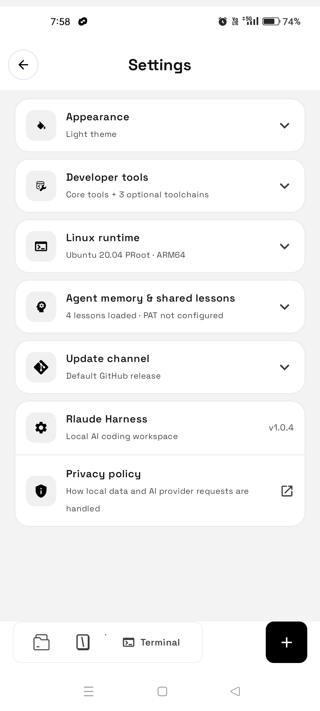
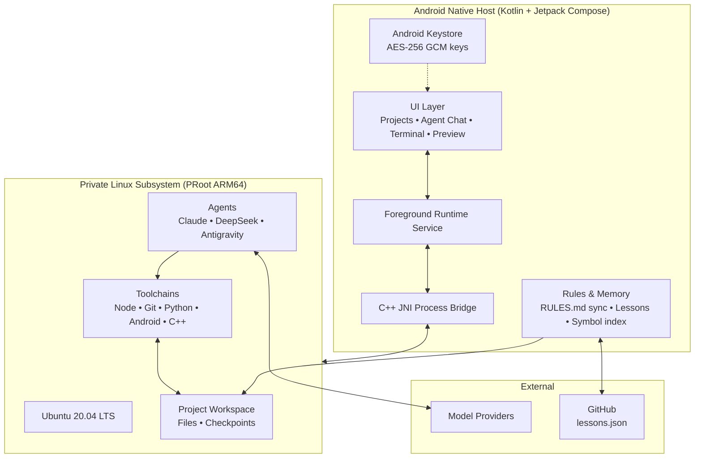

<div align="center">

  # Rlaude Harness

  ### *Code. Build. Ship. — an AI coding workspace that lives on your phone.*

  **Chat with coding agents, edit projects, run real Linux commands, preview web apps, and build Android APKs — all on-device, no PC needed.**

  <sub>Created & maintained by <a href="https://github.com/mrtuik"><b>Tuik (@mrtuik)</b></a> · Forked from <a href="https://github.com/techjarves/Mobile-Harness">Mobile Harness</a> by Tech Jarves</sub>

  <br />

  <table>
    <tr>
      <td align="center" width="25%"><br /><sub>Projects</sub></td>
      <td align="center" width="25%"><br /><sub>Agent chat</sub></td>
      <td align="center" width="25%"><br /><sub>AI Agent</sub></td>
      <td align="center" width="25%"><br /><sub>Settings</sub></td>
    </tr>
  </table>

  <br />

  [](#system-requirements)
  [](#system-requirements)
  [](#architecture)
  [](LICENSE)

  <br />

  [**Get the APK**](#get-the-apk) &nbsp;•&nbsp;
  [**What's New in Rlaude**](#whats-new-in-rlaude) &nbsp;•&nbsp;
  [**Agent Memory**](#agent-memory--shared-lessons) &nbsp;•&nbsp;
  [**Architecture**](#architecture) &nbsp;•&nbsp;
  [**Build from Source**](#build-from-source) &nbsp;•&nbsp;
  [**Credits**](#credits)

</div>

<br />

---

> [!NOTE]
> **Rlaude Harness is built by [Tuik (@mrtuik)](https://github.com/mrtuik).** It started from the open-source **[Mobile Harness](https://github.com/techjarves/Mobile-Harness)** by Tech Jarves (PRoot/Ubuntu runtime, C++ bridge, original foundation, MIT). Everything under [What's New in Rlaude](#whats-new-in-rlaude) — shared lessons, plan mode, subagents, screen map, symbol index, providers, the whole redesigned UI — is Tuik's work.

> [!IMPORTANT]
> **Environment security notice.** Rlaude Harness runs on **ARM64 Android devices** using a private userspace PRoot layer. PRoot is not a virtualization boundary or a hardened security jail. Only run projects and dependencies you own or trust.

<br />

## What is Rlaude Harness?

Rlaude Harness pairs a **Jetpack Compose** app with a self-contained **Ubuntu 20.04 ARM64** environment running inside PRoot. You get a desktop-style AI coding setup — Node.js, npm, Git, optional Python / Android / C++ / PHP toolchains — without root, Termux, or a computer.

It ships with three coding agents, each with its own bridge and settings:

| Agent | Authentication | Notes |
| :--- | :--- | :--- |
| **Claude Code** | Claude account or API-key providers | Included in Core runtime |
| **DeepSeek Harness** | API-key providers | Installed on demand |
| **Antigravity CLI** | Official Google sign-in | Version-pinned `agy` download |

<br />

## What's New in Rlaude

Everything below is on top of the original Mobile Harness.

### Agents that learn and behave consistently
* **Shared lessons from GitHub** — the app fetches a `lessons.json` from your own GitHub repo and injects those lessons into every agent prompt, so past mistakes are not repeated. See [Agent memory & shared lessons](#agent-memory--shared-lessons).
* **Automatic correction detection** — when you correct an agent, a small supervisor model decides whether it was a real mistake and reports a candidate lesson to your repo for review.
* **On-device lessons store** — a local SQLite log of mistakes the agents caught and fixed themselves, shared across Claude, DeepSeek, and Antigravity.
* **One rules file for every agent** — a single master `RULES.md` in the app is synced into each workspace as both `CLAUDE.md` and `AGENTS.md` before every run, so all three agents follow the same conventions.
* **Shared task rules** — one narration and self-verification rule set used by every bridge: short human-style progress updates, no leaked internal tags, and mandatory verification only when code was actually changed.

### Smarter code navigation
* **Screen map workflow** — for UI tasks the agent identifies the exact screen (from your screenshot, visible texts, or `root-tab/SCREENS.md`) before editing, and asks when two screens are equally likely. Works with short, messy, mixed Bangla-English messages.
* **Symbol index** — `root-tab/SYMBOLS.md` is regenerated every run (`path:line | kind | name`), so agents jump straight to a function instead of reading huge files.
* **Error context enrichment** — build errors and stack traces that contain `file:line` are resolved by the app itself, and the surrounding code is attached to your prompt *before* it reaches any agent.

### Plan mode and subagents
* **Plan toggle next to Send** — run a 4-stage pipeline (architect → analysis → task breakdown → your approval) before any file is touched, or skip straight to implementation.
* **Named subagent workers** — approved tasks are shared between **Tuik**, **Harmes**, and **Rthan**. A queued task can be reassigned to a different worker.
* **Single-agent default** — routine edits are done directly; subagents are only used when you ask.

### Providers
* Anthropic API, OpenRouter, DeepSeek, Kimi, **OpenCode Zen**, **NVIDIA NIM**, and custom gateways.
* Multiple saved API keys per provider with automatic failover, stored with Android Keystore AES-256-GCM.

### UI and design
* **Rlaude branding** across onboarding, settings, terminal, and update dialogs.
* **Modern settings screen** — Appearance (Dark / Light / System), Developer tools, Linux runtime, provider and API key management, update channel, and agent memory in collapsible cards.
* **Space Grotesk** app-wide font, bundled offline (light → bold).
* **Tuik icon system** — Material icons can be overridden by dropping `ic_tuik<name>` drawables into `res/drawable-nodpi`, plus a custom icon set (folder, file, GitHub, copy, download, refresh, settings, and more).
* **Preview with tuik** — a redesigned web preview screen with a file switcher and URL bar.
* **Tool cards** — Think / Read / Write / Search steps and *Files changed* cards in the agent chat.

### Build and release
* **GitHub Actions workflow** (`build-apk.yml`) builds the online debug APK in the cloud and uploads it as an artifact. It fetches the PRoot and libandroid-shmem sources if the submodules are empty, and builds the Antigravity bundle first.
* **`scripts/install-phone.sh`** — one command to build, install, and launch on a connected phone.

<br />

## Get the APK

The easiest way to get a build is from GitHub Actions:

1. Open the **Actions** tab of this repository.
2. Run **Build Rlaude Harness APK** (it also runs on every push to `main`).
3. Download the **`rlaude-harness-online-debug`** artifact, unzip it, and install the APK.

```text
Target Architecture : ARM64 (arm64-v8a)
Minimum OS Level    : Android 9.0 (API 28)
Install             : allow "Install unknown apps" for your browser / file manager
```

> Two flavors exist: **online** (small APK, runtime bundles are downloaded when needed) and **offline** (bundles embedded). The workflow builds the online flavor.

<br />

## Quickstart

1. **Install** the APK and open Rlaude Harness.
2. **Guided setup (~10 min)** — the wizard checks your device, installs the core Ubuntu runtime, lets you pick optional toolchains (Python, Android, C/C++, PHP), and connects an AI provider.
3. **Create & build** — tap **New Project** or **Quick Project**, open the AI workspace, and describe what you want. Watch the agent read files, write code, run builds, and launch a live preview.

For Antigravity, choose **Antigravity CLI**, install it, and tap **Sign in with Google**. The official CLI handles login; Rlaude never reads or copies its tokens.

> [!WARNING]
> Antigravity tasks launch with `--dangerously-skip-permissions`, so the agent can run tools without per-action approval. Use it only with projects and prompts you trust.

<br />

## Agent memory & shared lessons

Lessons are short rules that get injected into the agent prompt (up to 30 per run) so the agents stop repeating mistakes.

**Set it up**
1. Create a GitHub repo (default in the app: `mrtuik/RlaudeHarnessAgent`) with a `lessons.json` on the `main` branch. The app reads it from `raw.githubusercontent.com`, so the repo needs to be readable without login.
2. In the app open **Settings → Agent memory & shared lessons**, enter `owner/repo`, and tap **Refresh**.
3. Optional: save a **GitHub fine-grained PAT** so the app can report candidate lessons back to your repo.

**`lessons.json` format** — an array of strings, or objects with a `rule`, `lesson`, `summary`, `text`, `description`, or `title` field:

```json
[
  "Never run a full Gradle build to verify a tiny color/icon/string edit; only build when the user asks.",
  "When the user asks for 'more' variants, continue numbering after the highest existing one and never overwrite existing variants."
]
```

Candidate lessons detected from your corrections go to `pending_candidates.json` for you to review before promoting them into `lessons.json`.

> The correction detector uses a Groq model. It only runs if a `GROQ_API_KEY` was provided at build time (see below); without it the feature is simply skipped.

<br />

## Architecture



**Repository layout**

```text
RlaudeHarness/
├── app/src/main/
│   ├── java/com/jarves/mh/
│   │   ├── data/       # Preferences, Keystore vault, lessons repository
│   │   ├── model/      # Providers, agents, pipeline models
│   │   ├── network/    # Provider API client, lesson reporter
│   │   ├── runtime/    # PRoot installer, agent bridges, rules manager, checkpoints
│   │   ├── theme/      # App font (Space Grotesk)
│   │   ├── ui/         # Compose screens, Tuik icons, settings, preview
│   │   └── update/     # In-app updater
│   ├── cpp/            # Native launcher and process bridge
│   └── res/            # Icons, fonts, vector drawables
├── scripts/            # install-phone, runtime bundle builders, CI helpers
├── .github/workflows/  # build-apk.yml
├── fastlane/  docs/  fdroid/
└── third_party/        # talloc (PRoot / libandroid-shmem are fetched as submodules)
```

The Java package (`com.jarves.mh`) is kept from the upstream project.

<br />

## Build from Source

**Prerequisites:** JDK 17, Android SDK API 36, NDK `26.1.10909125`, CMake `3.22.1`.

```bash
git clone --recurse-submodules https://github.com/mrtuik/RlaudeHarness.git
cd RlaudeHarness

# Antigravity bundle must exist before Gradle runs
bash scripts/runtime-bundles/build-agy-from-official.sh
python3 scripts/ci/patch-agy-checksum.py

# Optional: enable correction detection
export GROQ_API_KEY=your_key_here

# Build the online debug APK
./gradlew assembleOnlineDebug

# Or build, install and launch on a connected phone
sh scripts/install-phone.sh
```

```bash
./gradlew testDebugUnitTest   # unit tests
./gradlew lintDebug           # lint
```

`third_party/proot` and `third_party/libandroid-shmem` are git submodules. If you downloaded a plain ZIP they will be empty; the GitHub Actions workflow re-fetches them automatically.

<br />

## System Requirements

| Metric | Minimum | Recommended |
| :--- | :--- | :--- |
| **OS** | Android 9.0 (API 28) | Android 13+ |
| **CPU** | 64-bit ARM (`arm64-v8a`) | 8-core ARM64 |
| **RAM** | 4 GB | 8 GB+ |
| **Free storage** | 2.5 GB | 8 GB+ |
| **Network** | Needed for setup and API calls | Fast Wi-Fi for first setup |

<br />

## Security and Privacy

* **No middlemen** — the app talks directly to the AI endpoint you choose.
* **Encrypted secrets** — API keys use Android Keystore-backed AES-256-GCM.
* **Verified downloads** — runtime archives are checked with SHA-256 before extraction.
* **Scoped storage** — imports and exports use the Storage Access Framework.

See [PRIVACY.md](PRIVACY.md).

## Current Limitations

* ARM64 devices only.
* PRoot is not a hardened container or VM; Docker, KVM, and systemd are not supported.
* The terminal uses a process bridge, not a full PTY, so full-screen ncurses programs may render oddly.
* Heavy builds can be slow and may be throttled by Android battery optimization. Exempt Rlaude Harness from battery optimization for long tasks.
* Custom providers may not support Claude-style thinking, tool use, or streaming.

<br />

## Credits

* **[Tuik (@mrtuik)](https://github.com/mrtuik)** — creator and maintainer of **Rlaude Harness**: all features listed under *What's New in Rlaude*, UI redesign, agent memory system, and release workflow.
* **[Tech Jarves](https://www.youtube.com/techjarves)** — creator of **[Mobile Harness](https://github.com/techjarves/Mobile-Harness)**, the open-source project Rlaude Harness started from. PRoot/Ubuntu runtime, native bridge, and original app foundation (MIT).
* **[Termux](https://github.com/termux)** — PRoot and libandroid-shmem sources.
* **Anthropic, Google, DeepSeek** — Claude Code, Antigravity CLI, and DeepSeek Harness, each under their own licenses.
* **Space Grotesk** font — Florian Karsten (SIL Open Font License).

## Legal

* Rlaude Harness is an independent open-source project and is not affiliated with, endorsed by, or sponsored by Anthropic, Google, or Tech Jarves.
* **Claude** and **Claude Code** are trademarks of Anthropic, PBC.
* Third-party licenses are collected in [`app/src/main/assets/licenses`](app/src/main/assets/licenses).

## License

Licensed under the [MIT License](LICENSE). The original Mobile Harness copyright notice is kept in the `LICENSE` file as the MIT License requires. Third-party binaries and packages keep their own upstream licenses.

<br />

---

<div align="center">
  <sub>Rlaude Harness by <b><a href="https://github.com/mrtuik">Tuik</a></b> · Built on Mobile Harness by <a href="https://github.com/techjarves/Mobile-Harness">Tech Jarves</a></sub>
</div>
